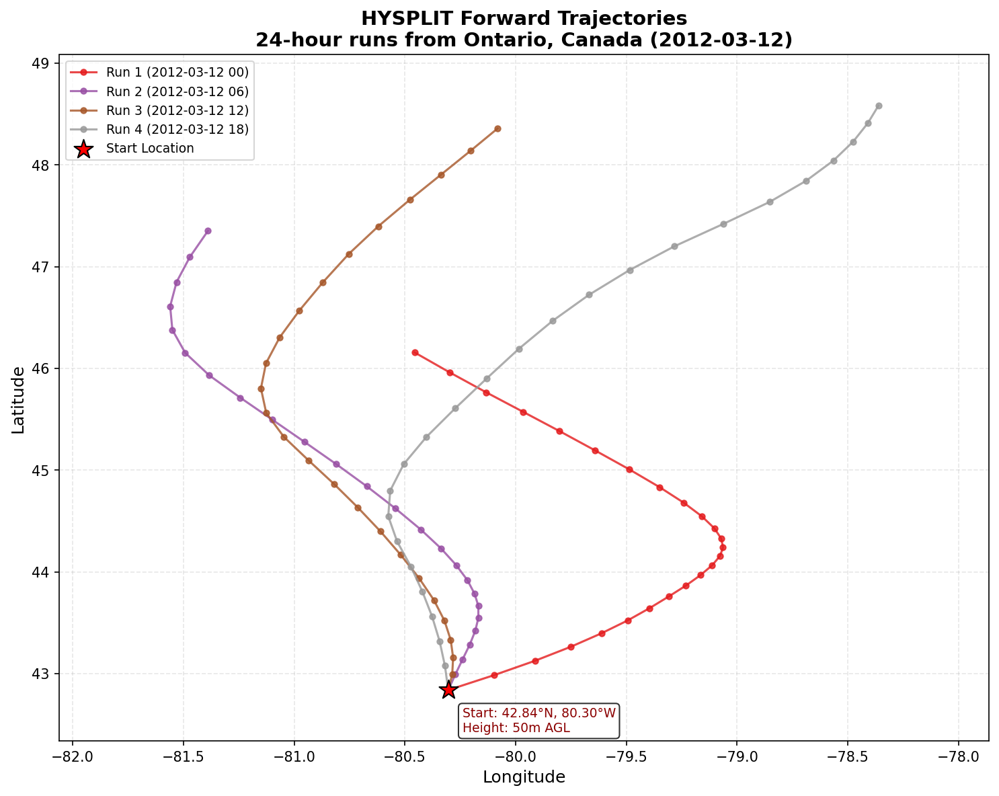
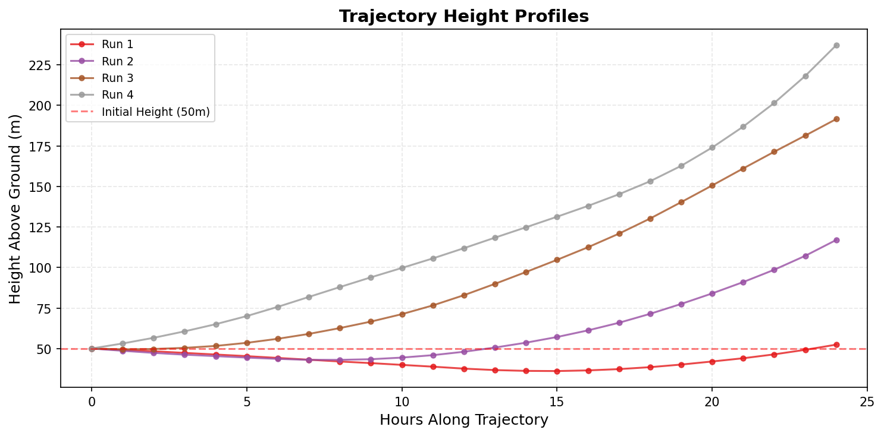
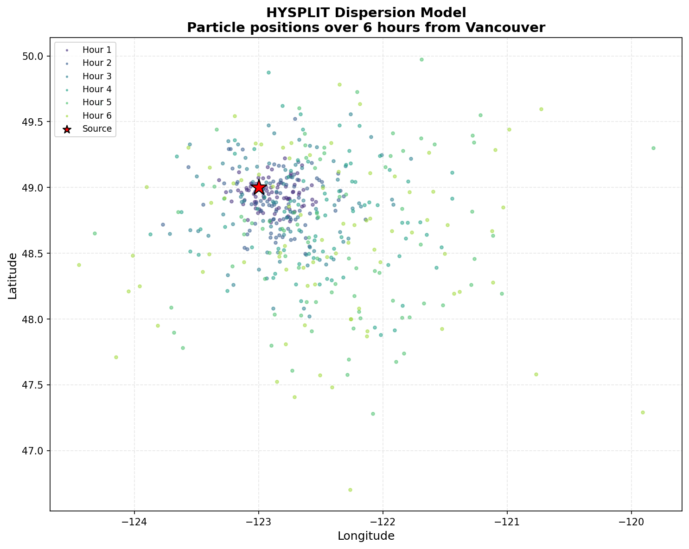

# hysplit 

<!-- badges: start -->
[](https://badge.fury.io/py/hysplit)
[](https://www.python.org/downloads/)
[](https://opensource.org/licenses/MIT)
<!-- badges: end -->

**hysplit** is a **Python** package for conducting trajectory and dispersion modeling with **HYSPLIT**. This is a Python port of the R [splitr](https://github.com/rich-iannone/splitr) package with additional C++ optimizations for performance.

We can determine, from one or more receptor sites, where arriving air masses originated. Conversely, it's possible to model trajectories of air masses from receptor sites. Forward and backward modeling of gas-phase or particulate matter can also be conducted from defined sites. It's a means to help explain how, where, and when chemicals and materials are atmospherically transported, dispersed, and deposited.

## Applications

This model has many applications:

- **Flood prediction**: Modeling atmospheric transport of moisture to determine probable extreme rainfall locations ([Gustafsson et al., 2010](http://tellusa.net/index.php/tellusa/article/view/15715))
- **Cloud formation**: Understanding long-range transported dust and biological aerosols affecting cloud ice formation ([Creamean et al., 2013](http://science.sciencemag.org/content/339/6127/1572.full))
- **Invasive species**: Understanding dispersal abilities for conservation and landscape management ([Lander et al., 2014](http://onlinelibrary.wiley.com/doi/10.1002/ece3.1206/abstract))
- **Plant disease management**: Modeling long-distance transport of high-risk plant pathogens ([Schmale and Ross, 2015](http://www.annualreviews.org/doi/abs/10.1146/annurev-phyto-080614-115942))

## Features

- **Easy-to-use API**: Build and run HYSPLIT models with minimal code
- **Method chaining**: Fluent interface similar to pandas/dplyr pipelines
- **Automatic met data**: Downloads meteorological files from NOAA servers
- **Cluster computing support**: Pre-download data for offline HPC execution
- **Interactive visualization**: Maps with Folium, plots with Matplotlib
- **C++ optimizations**: Fast file parsing and data processing
- **Full pandas integration**: Filter, group, aggregate results with pandas

## Installation

### From PyPI (Recommended)

```bash
pip install hysplit
```

### With visualization support

```bash
pip install "hysplit[viz]"
```

### With all optional dependencies

```bash
pip install "hysplit[all]"
```

### From source (development)

```bash
git clone https://github.com/quishpi/hysplit.git
cd hysplit
pip install -e ".[dev]"
```

## HYSPLIT Trajectory Model Runs

To perform a series of HYSPLIT trajectory model runs, use the `hysplit_trajectory()` function:

```python
import hysplit

trajectory = hysplit.hysplit_trajectory(
    lat=42.83752,
    lon=-80.30364,
    height=50,
    duration=24,
    days=["2012-03-12"],
    daily_hours=[0, 6, 12, 18],
    direction="forward",
    met_type="gdas1",
    extended_met=True,
    met_dir="./met",
    exec_dir="./out"
)
```

This use of `hysplit_trajectory()` sets up four trajectory runs that start at 00:00, 06:00, 12:00, and 18:00 UTC on March 12, 2012 (using `days=["2012-03-12"]` and `daily_hours=[0, 6, 12, 18]`). These runs are 24 h in duration (`duration=24`).

The receptor/origin locations are set using `lat` and `lon` for the latitude(s) and longitude(s). The starting location of 42.83752°N and 80.30364°W is set here using `lat=42.83752` and `lon=-80.30364`. Lists of `lat` and `lon` values can be used here to create an ensemble of model runs. The starting height of 50 m above ground level is set by `height=50`.

The model runs as set above are forward runs (moving forward in time, set here using `direction="forward"`) and not backtrajectory runs (set with `direction="backward"`).

The meteorological options include the type of met data to use. The 1° **GDAS** data is used here with `met_type="gdas1"` but there is also the option to use **NCEP** reanalysis data with the `met_type="reanalysis"` setting and **NARR** (North American Regional Reanalysis) data with `met_type="narr"`. The necessary meteorological data files relevant to the period being modeled will be downloaded from the **NOAA** FTP server if they are not present in the working directory.

The function will return a pandas DataFrame containing trajectory information. The DataFrame will have the following columns when `extended_met` is set to `False`:

- `run` the index value for an individual model run
- `receptor` a numeric label for the receptor, which is a 3-dimensional position
- `hour_along` the integer hour difference (positive for forward trajectories, negative for backward trajectories) for the trajectory position compared to the run starting time
- `traj_dt` the date-time value for the trajectory location
- `lat`, `lon`, `height` the latitude, longitude, and height (meters above ground level) of the air mass along the trajectory
- `traj_dt_i`, `lat_i`, `lon_i`, `height_i` the initial values (at the model start) for `traj_dt`, `lat`, `lon`, and `height`
- `pressure` the air pressure at each position and time along the trajectory (in hPa)

If the model is run with `extended_met` set to `True` then the following along-trajectory values will also be available in the output DataFrame:

- `theta` the potential temperature (in K)
- `air_temp` the ambient air temperature (in K)
- `rainfall` the rate of rainfall (in mm/h)
- `mixdepth` the mixing depth (or mixing height, in meters)
- `rh` the relative humidity
- `sp_humidity` the specific humidity (in g/kg)
- `h2o_mixrate` the mixed layer depth (in meters)
- `terr_msl` the terrain height at the location defined by `lat` and `lon`
- `sun_flux` the downward solar radiation flux (in watts)

Models can also be defined and executed using a modeling object in a method-chaining workflow. Here's an example:

```python
import hysplit

# Create the trajectory model object, add
# various parameters, and execute the model runs
trajectory_model = (
    hysplit.create_trajectory_model()
    .add_trajectory_params(
        lat=43.45,
        lon=-79.70,
        height=50,
        duration=6,
        days=["2015-07-01"],
        daily_hours=[0, 12],
        direction="backward",
        met_type="reanalysis",
        met_dir="./met",
        exec_dir="./out"
    )
    .run()
)
```

Here, we create a `TrajectoryModel` object which serves as a container for the model definition and for the results.

This pipeline setup allows for more flexibility as Python objects can be piped in for variation in the types of models created. The `create_trajectory_model()` function creates the trajectory model object. One or more `add_trajectory_params()` calls can be used to write model parameters to the model object. Ending the pipeline with `run()` runs the model and creates results.

The trajectory data can be extracted from the trajectory model object using the `get_output_tbl()` method:

```python
# Get a DataFrame containing the model results
trajectory_df = trajectory_model.get_output_tbl()

print(trajectory_df)
```

…and a pandas DataFrame of output data is returned:

```
    run  receptor  hour_along             traj_dt    lat    lon  height  pressure
0     1         1           0 2015-07-01 00:00:00  43.45 -79.70    50.0    1013.2
1     1         1          -1 2015-06-30 23:00:00  43.42 -79.72    44.1    1014.1
2     1         1          -2 2015-06-30 22:00:00  43.35 -79.78    39.0    1015.0
3     1         1          -3 2015-06-30 21:00:00  43.28 -79.82    34.5    1015.8
4     1         1          -4 2015-06-30 20:00:00  43.22 -79.74    30.7    1016.5
5     1         1          -5 2015-06-30 19:00:00  43.18 -79.68    27.4    1017.1
6     1         1          -6 2015-06-30 18:00:00  43.12 -79.65    24.5    1017.6
7     2         1           0 2015-07-01 12:00:00  43.45 -79.70    50.0    1012.8
...
```

#### Plotting Trajectory Data

Trajectories can be plotted onto an interactive map. Use the `trajectory_plot()` function with the trajectory DataFrame:

```python
# Plot results using the trajectory DataFrame
hysplit.trajectory_plot(trajectory_df)
```

…or, with a trajectory model object:

```python
# Plot results using the trajectory model object
trajectory_model.trajectory_plot()
```

The visualization shows trajectory paths with markers at each hourly position:



Height profiles show how the air mass altitude changes along the trajectory:



## HYSPLIT Dispersion Runs

Dispersion models can also be conveniently built and executed. Begin the process with the `create_dispersion_model()` function. Use one or more `add_dispersion_params()` calls to write parameters to the model object. The `add_source()` method defines emission sources and properties.

As with the trajectory model, the pipeline can be ended with `run()`. To extract a DataFrame containing the modeled output data, use the `get_output_tbl()` method. An example:

```python
import hysplit
from datetime import datetime, timedelta

start_time = datetime(2015, 7, 1, 0, 0)

# Create the dispersion model object, add
# source and run parameters, then execute
dispersion_model = (
    hysplit.create_dispersion_model()
    .add_source(
        name="particle",
        lat=49.0,
        lon=-123.0,
        height=50,
        rate=5,
        pdiam=15,
        density=1.5,
        shape_factor=0.8,
        release_start=start_time,
        release_end=start_time + timedelta(hours=2)
    )
    .add_dispersion_params(
        start_time=start_time,
        end_time=start_time + timedelta(hours=6),
        direction="forward",
        met_type="reanalysis",
        met_dir="./met",
        exec_dir="./out"
    )
    .run()
)
```

This dispersion model formally begins at 00:00 UTC on July 1, 2015 (using the `start_time` argument). The model run is a forward run (i.e., moving forward in time, with `direction="forward"`) and not backward (which could be set with `direction="backward"`). Essentially, running in forward mode means the starting location is a source of emissions; running backward means that the starting location is a receptor.

This run has been set to be modeled for 6 h. The starting location of 49.0°N and 123.0°W is set using `lat=49.0` and `lon=-123.0`; the starting height of 50 m above ground level is set by `height=50`. The meteorological options include the type of met data to use (global NCEP Reanalysis data is used here with `met_type="reanalysis"`).

A single emissions species is set to be emitted (using `add_source()`) for 2 hours at an emission rate of 5 mass units per hour (`rate=5`). The properties of the emitted pollutant are defined in the `add_source()` call. Here, the physical properties of particle diameter (in micrometers), density (in grams per cubic centimeter), and shape factor (value from 0 to 1), respectively, are defined with `pdiam=15`, `density=1.5`, and `shape_factor=0.8`.

The output data can be extracted from the dispersion model object:

```python
# Get a DataFrame containing the model results
dispersion_df = dispersion_model.get_output_tbl()
print(dispersion_df)
```

…and the data is conveniently supplied as a pandas DataFrame:

```
   particle_i  hour    lat     lon  height
0       00001     1  48.92 -123.05   152.0
1       00002     1  48.89 -123.12   289.0
2       00003     1  48.91 -123.08   297.0
3       00004     1  49.02 -122.98    53.0
4       00005     1  48.88 -123.15   804.0
...
```

#### Plotting Dispersion Data

Dispersion data can also be plotted onto a map. Use the `dispersion_plot()` function with the dispersion model object:

```python
# Plot particle data onto a map
dispersion_model.dispersion_plot()
```

The visualization shows particle positions at each hour, with colors indicating time progression:



## Cluster Computing (HPC) Workflows

For high-performance computing environments without internet access, the package supports a two-phase workflow:

### Phase 1: Download Meteorological Data (machine with internet)

```python
from hysplit.workflows import download_met_data, create_met_manifest

# Download all needed met files
manifest = download_met_data(
    met_type="reanalysis",
    start_date="2012-01-01",
    end_date="2012-12-31",
    output_dir="/data/met/reanalysis",
    buffer_days=2,           # Extra days for boundary conditions
    compute_checksums=True   # For data validation
)

# Save manifest for transfer to cluster
create_met_manifest(manifest, "/data/met/manifest.json")
```

### Phase 2: Run Models on Cluster (offline)

```python
from hysplit.workflows import run_trajectory_offline, load_met_manifest

# Load pre-downloaded manifest
manifest = load_met_manifest("/scratch/met/manifest.json")

# Run trajectory without internet
trajectory = run_trajectory_offline(
    lat=42.83752,
    lon=-80.30364,
    height=50,
    duration=24,
    days=["2012-03-12"],
    met_manifest=manifest,
    exec_dir="/scratch/output"
)
```

### Batch Processing with Parallel Execution

```python
from hysplit.workflows import create_batch_config, run_batch_trajectories

# Define batch configuration
config = create_batch_config(
    locations=[
        {"lat": 42.83752, "lon": -80.30364},
        {"lat": 43.65107, "lon": -79.34702},
        {"lat": 45.50169, "lon": -73.56725},
    ],
    days=["2012-03-10", "2012-03-11", "2012-03-12"],
    daily_hours=[0, 6, 12, 18],
    duration=48,
    met_dir="/data/met",
    exec_dir="/scratch/output"
)

# Run with 8 parallel workers
results = run_batch_trajectories(config, n_workers=8)
```

## Meteorological Data Types

| Type | Description | Resolution | Coverage |
|------|-------------|------------|----------|
| `gdas1` | GDAS 1-degree | 1° × 1° | Global |
| `gdas0p5` | GDAS 0.5-degree | 0.5° × 0.5° | Global |
| `reanalysis` | NCEP/NCAR Reanalysis | 2.5° × 2.5° | Global |
| `narr` | North American Regional | 32 km | North America |
| `nam12` | NAM 12 km | 12 km | North America |
| `gfs0p25` | GFS 0.25-degree | 0.25° × 0.25° | Global |
| `era5` | ERA5 Reanalysis | 0.25° × 0.25° | Global |

## Performance

Python **hysplit** is approximately 5% faster than R **splitr** for identical workloads. The bottleneck is the HYSPLIT Fortran binary (98% of runtime), which both packages call.

The package includes C++ optimizations for file parsing:

| Operation | Pure Python | With C++ | Speedup |
|-----------|-------------|----------|---------|
| Trajectory parsing | ~10 ms | ~1 ms | **10x** |
| Binary met reading | ~50 ms | ~5 ms | **10x** |

For maximum performance, use parallel batch processing with `run_batch_trajectories()`.

## HYSPLIT Citations

Stein, A.F., Draxler, R.R, Rolph, G.D., Stunder, B.J.B., Cohen, M.D., and Ngan, F., (2015). NOAA's HYSPLIT atmospheric transport and dispersion modeling system, Bull. Amer. Meteor. Soc., 96, 2059-2077, http://dx.doi.org/10.1175/BAMS-D-14-00110.1

Draxler, R.R., 1999: HYSPLIT4 user's guide. NOAA Tech. Memo. ERL ARL-230, NOAA Air Resources Laboratory, Silver Spring, MD.

Draxler, R.R., and G.D. Hess, 1998: An overview of the HYSPLIT_4 modeling system of trajectories, dispersion, and deposition. Aust. Meteor. Mag., 47, 295-308.

## Related Projects

- [splitr](https://github.com/rich-iannone/splitr) - The original R package this is ported from
- [HYSPLIT](https://www.ready.noaa.gov/HYSPLIT.php) - NOAA's HYSPLIT model

## License

MIT License - see [LICENSE](LICENSE) file for details.

## Contributing

Contributions are welcome! Please feel free to submit a Pull Request.
